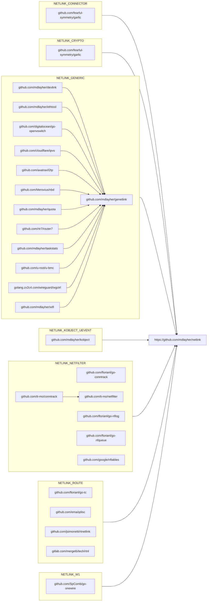

# netlink    

Package `netlink` provides low-level access to Linux netlink sockets.
MIT Licensed.

For more information about how netlink works, check out my blog series
on [Linux, Netlink, and Go](https://mdlayher.com/blog/linux-netlink-and-go-part-1-netlink/).

If you have any questions or you'd like some guidance, please join us on
[Gophers Slack](https://invite.slack.golangbridge.org) in the `#networking`
channel!

## Stability

See the [CHANGELOG](./CHANGELOG.md) file for a description of changes between
releases.

This package has a stable v1 API and any future breaking changes will prompt
the release of a new major version. Features and bug fixes will continue to
occur in the v1.x.x series.

In order to reduce the maintenance burden, this package is only supported on
Go 1.12+. Older versions of Go lack critical features and APIs which are
necessary for this package to function correctly.

**If you depend on this package in your applications, please use Go modules.**

## Design

A [number of netlink packages](https://godoc.org/?q=netlink) are already
available for Go, but I wasn't able to find one that aligned with what
I wanted in a netlink package:

- Straightforward, idiomatic API
- Well tested
- Well documented
- Doesn't use package/global variables or state
- Doesn't necessarily need root to work

My goal for this package is to use it as a building block for the creation
of other netlink family packages.

## Ecosystem

Over time, an ecosystem of Go packages has developed around package `netlink`.
Many of these packages provide building blocks for further interactions with
various netlink families, such as `NETLINK_GENERIC` or `NETLINK_ROUTE`.

To have your package included in this diagram, please send a pull request!

